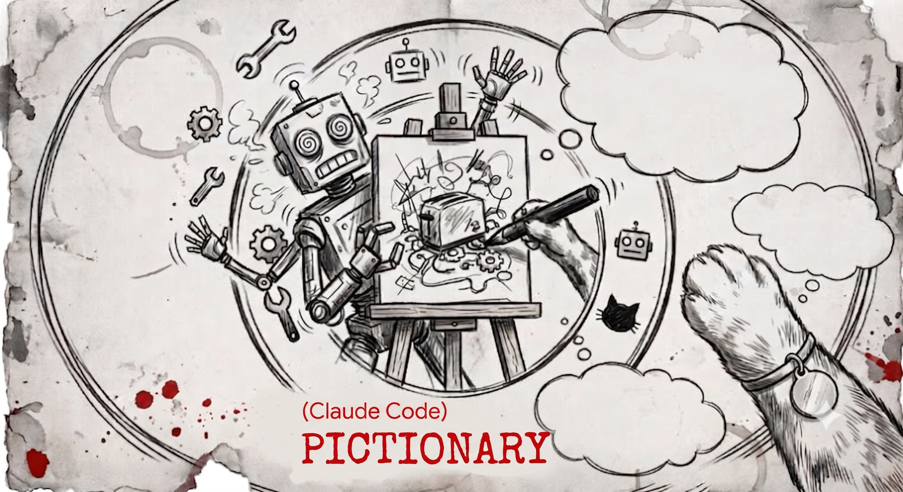
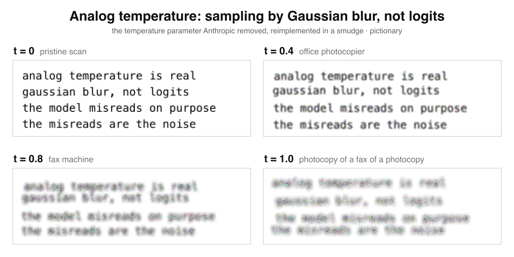

# pictionary



**Anthropic removed the `temperature` parameter. Pictionary puts it back, in Gaussian blur.**

The newest models (Fable 5, Opus 4.8/4.7) return a 400 if you send `temperature`;
the official guidance is to "prompt for it." Pictionary disagrees: it renders your
prompt to an image and **physically smudges it** until the model misreads its way
into being creative. The misreads *are* the sampling noise.

I measured it. On a question Opus normally answers identically, turning the knob up
made the output **3x more varied**:

| temperature | regime | output diversity |
|--:|---|--:|
| 0.0 | pristine scan | 0.25 |
| 0.4 | office photocopier | 0.74 |
| 0.8 | fax machine | 0.75 |

<sub>`claude-opus-4-8`, 8 runs/level, balanced density. Diversity = mean pairwise edit
distance across runs (0 = identical). Reproduce: `pictionary bench --runs 8`.</sub>

> A meme, built petite, not a serious sampling system. The knob is, annoyingly, real.

## Quickstart

```
npm i -g pictionary
pictionary install-skill
pictionary pack prompt.txt --temperature 0.8
```

Then, in Claude Code, `Read` the PNG instead of the text file, the only stochastic
decoding left on the frontier.

| t | regime |
|--|--|
| `0` | pristine scan (deterministic-ish) |
| `0.4` | office photocopier |
| `0.8` | fax machine |
| `1.0` | photocopy of a fax of a photocopy |

Billing is unchanged (same pixels). Fidelity is not. That's the point. The smudge
scales with font size, so the knob bites at any density, not just the tiny one.

### What the smudge looks like

Same four lines, four temperatures, pristine scan to photocopy-of-a-fax:



## It's also cheaper (the pxpipe trick)

Claude bills images at ~`(w × h) / 750` tokens, capped near 4,784/image; text at
~4 chars/token. Pack enough characters under that cap and a page of text bills like
a fraction of itself, up to ~3.8x cheaper at `max` density. Real files rarely fill
every line, though, so run `pictionary pack --dry-run` first, it tells you whether
packing your actual file wins.

| density | font | best case | fidelity |
|---|---|--:|---|
| `conservative` *(default)* | ~14px | ~1.05x (often break-even) | near-lossless |
| `balanced` | ~12px | ~1.6x | good |
| `max` | ~8px | ~3.8x | lossy risk |

Pages land in the billing sweet spot (≤2576px long edge, ≤3.75MP) so nothing silently
downscales; long inputs paginate to `file.p1.png`, `.p2.png`, …

## Commands

- `pack <file> [--density …] [--temperature 0..1] [--out dir] [--dry-run]`: render
  the PNG(s) + a savings report. `--dry-run` prints the token math without rendering.
- `bench [--prompt-file f] [--runs N] [--density …]`: measure whether the smudge
  actually moves the output, via `claude -p` over your OAuth login (no API key, no SDK).
- `install-skill`, teach Claude Code when to reach for this, and when not to.

## Caveats

- **OCR fidelity**: the model reads pixels; misreads happen (the feature at high
  temperature, the bug at low). Never pack anything byte-exact: IDs, hashes, code you'll edit.
- **No prompt caching**: image reads skip the cached-prefix discount. Best for read-once bulk.
- **The extra turn**: in an agent, Reading a PNG is another tool call that re-sends
  the conversation; on a short chat that can erase the packing savings. It wins when
  the file is big and the surrounding context is small or already cached. `bench`
  measures it end-to-end, not just the static math.

Keep load-bearing text as text; pack the boring bulk. The bundled skill encodes exactly that.

## Prior art

[**pxpipe**](https://github.com/teamchong/pxpipe) does the token savings for real:
a proxy that auto-images your API traffic with profitability gates and production
benchmarks (~3.1x on dense content, independently confirming the math). Pictionary is
the temperature knob wearing a party hat. Want a lower bill? Use pxpipe. Want your
sampling parameter back? Right repo.

## What it isn't

No proxy, no MCP server, no hooks, no auto-interception, no telemetry, no config files.
One runtime dep (`sharp`). Petite by design.

MIT.
